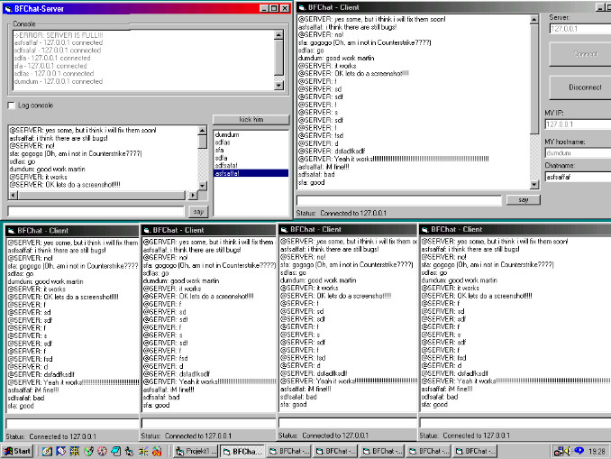



## A chat porgram: BFChat\-client/server

### Description

A client-server chat program:

- Up to 6 clients on ervery server!

- Automatic namededection!

- Kick people from the server!

- Automatic IPdectection!

- Every client is able to see who is on the server!
 
### More Info
 

             |
---                |---
**Submitted On**   |2000-04-07 16:29:40
**By**             |[N/A](https://github.com/Planet-Source-Code/PSCIndex/blob/master/ByAuthor/empty.md)
**Level**          |Intermediate
**User Rating**    |4.0 (95 globes from 24 users)
**Compatibility**  |VB 5\.0, VB 6\.0
**Category**       |[Internet/ HTML](https://github.com/Planet-Source-Code/PSCIndex/blob/master/ByCategory/internet-html__1-34.md)
**World**          |[Visual Basic](https://github.com/Planet-Source-Code/PSCIndex/blob/master/ByWorld/visual-basic.md)
**Archive File**   |[CODE\_UPLOAD4601472000\.zip](https://github.com/Planet-Source-Code/a-chat-porgram-bfchat-client-server__1-7090/archive/master.zip)

